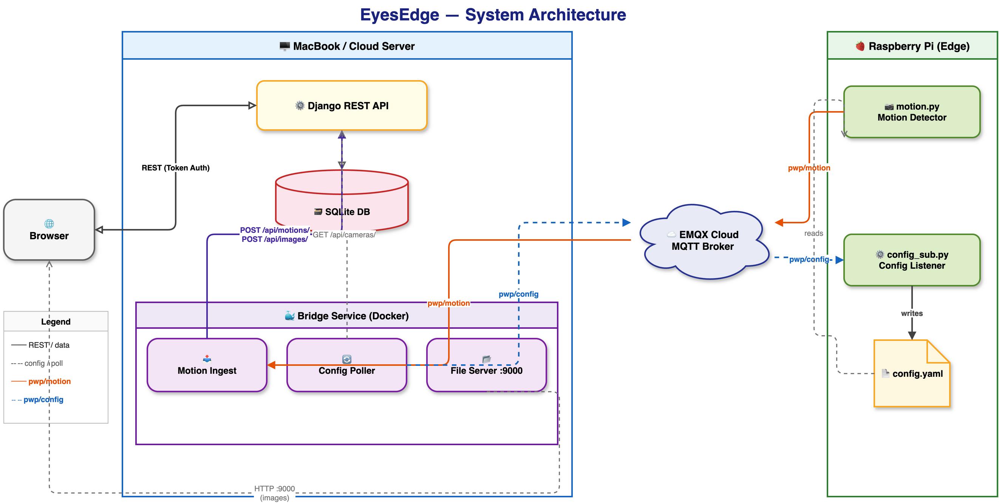

# EyesEdge Bridge

Connects the Pi-side auxiliary services to the cloud REST API over MQTT.

## Architecture



> Open [`architecture.drawio`](architecture.drawio) in draw.io for the interactive version.

## What it does

- **Motion ingest** — subscribes to `pwp/motion`, decodes the JPEG, saves it locally, then POSTs a `MotionEvent` + `Image` record to the API.
- **Config push** — polls `/api/cameras/` every N seconds and publishes `{main_width, main_height, fps}` to `pwp/config` whenever a camera changes.
- **File server** — serves captured JPEGs over HTTP on port `9000` so the `Image.filepath` URLs are reachable from the browser.

## Setup

Copy `.env.example` to `.env` and fill in the values:

```bash
cp .env.example .env
```

Key variables:

| Variable | Description |
|---|---|
| `MQTT_BROKER` | EMQX Cloud hostname |
| `MQTT_USERNAME` / `MQTT_PASSWORD` | MQTT credentials |
| `API_BASE` | Django API URL (`http://host.docker.internal:8000` for Docker, `http://127.0.0.1:8000` for local) |
| `API_TOKEN` | DRF token — get one with `python manage.py drf_create_token <user>` |
| `CAMERA_MAP` | Comma-separated `mac=uuid` pairs mapping Pi MAC addresses to Camera UUIDs in the API |
| `BRIDGE_PUBLIC_URL` | Public URL of the file server (used as `Image.filepath` in the API) |

### CAMERA_MAP example

After adding a camera in the API, copy its UUID from `/api/cameras/` and map it to the Pi's MAC:

```
CAMERA_MAP=dc:a6:32:51:e5:02=60ddc147-14fc-4fd9-b7a8-5b46246be866
```

Multiple cameras: comma-separated.

## Run with Docker (recommended)

```bash
docker compose up --build -d    # build and start
docker logs -f eyesedge-bridge  # live logs
docker compose stop             # stop
docker compose up -d            # restart without rebuild
```

## Run locally

```bash
pip install -r requirements.txt
python bridge.py
```

## Directory layout

```
bridge/
  bridge.py           # main service
  Dockerfile
  docker-compose.yml
  requirements.txt
  .env                # local config (git-ignored)
  .env.example        # template
  architecture.drawio # system architecture diagram
  captures/           # saved JPEGs (created at runtime)
```
